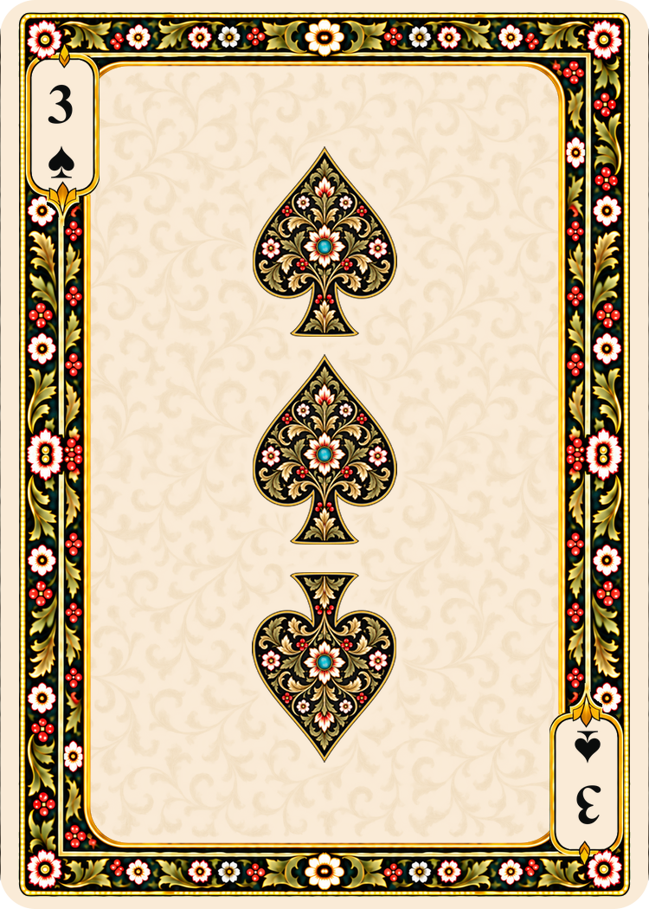

# Playing Cards

An illustrated collection for software and printing: **270 faces and 30 backs**.
Poker, Jumbo, Travel, Bridge, and European Standard each have 52 suited cards
and two Jokers. All 300 active images use the
[format-aware component renderer](docs/design/face-formats-v1.md).



The rebuilt deck has a common botanical frame, antique-white ground
(`#FAEBD7`), exact center anchors, and 3.5 mm rounded corners. Poker faces
and backs are 750 x 1050 pixels at nominal 300 dpi. Active PNGs use **RGBA**
so the rounded silhouette travels with the image. Face frames follow suit color:
Lamp Black for spades/clubs and the black Joker, Madder Lake for hearts/diamonds
and the red Joker. Back frames follow their named palette. Aces, numbers, and
Jokers include faint gold botanical tracery with clear halos around their artwork.
The [gilded vine front template](docs/design/front-tracery-v3.md) uses fine
arabesque scrollwork and acanthus leaves in light antique-gold ink.

The aces and numeral pips use four reusable illustrated suit masters. Positions,
sizes, orientations, and component hashes are defined in
[the layout manifest](docs/design/numeral-layout-v1.json).
Native-format Twos, Fours, Sixes, Eights, Tens, both Jokers, and all backs are
pixel-exact under a half-turn. European faces are Bridge resizes; interpolation
can introduce single-level pixel differences between paired ornament.
The odd numeral ranks intentionally retain one-way pips. Courts preserve the
original painted opposing portraits, with a common frame and registered dot;
their portraits are not pixel-exact half-turn duplicates.

## Files

- `cards/faces/french-suited/<format>/<suit>/<rank>.png`: active faces.
- `cards/faces/french-suited/<format>/jokers/<black|red>.png`: the two unsuited Jokers per format.
- `cards/backs/<format>/<color>.png`: active backs.
- `catalog.json`: actual paths, IDs, hashes, pixel dimensions, and print sizes.
- `deck.json`: formats, colors, suits, and ranks.
- `sources/components/poker/v1/`: reusable frame, masks, indices, and pips.
- `sources/components/poker/v2/`: dedicated panel-free back frame and Jokers.
- `sources/generated/deck-rebuild-v1/`: generated masters and exact prompts.
- `sources/before-deck-rebuild-v1/`: all 82 original images and hash inventory.
- `scripts/rebuild_deck.py`: component preparation, rendering, validation,
  previews, and checked promotion.
- `scripts/expand_faces.py`: current native face compositor and checked promotion.
- `scripts/frame_palette.py`: explicit frame palettes.
- `work/face-formats-v1/`: current staging images and review sheets.
- `sources/before-face-formats-v1/`: all 84 pre-expansion images and hash inventory.

The five back colors are Lamp Black, Madder Lake, Manganese Violet,
Prussian Blue, and Verdigris. They are pigment-inspired digital labels.
The complete poker deck has 52 suited cards and two Jokers. Tarot-sized backs do not imply
that tarot faces exist; Tarot fronts remain a separate production task.
The [Design 2 prototype](docs/design/design2-v1.md) is also outside the active catalog.

## Software use

Read `catalog.json` and select assets by ID or attributes. Paths are relative
to the repository root:

```python
import json
from pathlib import Path

root = Path("/path/to/playing-cards")
catalog = json.loads((root / "catalog.json").read_text(encoding="utf-8"))
assets = {card["id"]: card for card in catalog["assets"]}
face = root / assets["face.french-suited.poker.spades.king"]["path"]
back = root / assets["back.poker.lamp-black"]["path"]
```

Keep alpha, preserve aspect ratio, and use the same display rectangle for cards
of a format. Do not add a separate corner-radius clip. The exact poker center
is (374.5, 524.5) in zero-based pixel-center coordinates, or (375, 525) measured
from the outside edges of the canvas.

The existing [gallery](index.html) reads the catalog. Serve the repository over
HTTP to browse it; click a card to inspect it at a larger size.

## Printing

The active files under `cards/` are individual trim-size artworks, without bleed, crop marks, gutters,
or imposed press sheets. Place by catalog `trim_inches`; do not infer physical
size from PNG density metadata. Composite transparency onto the intended paper
background for workflows requiring opaque RGB.

Build all five non-Tarot releases with `python scripts/package_decks.py --build --all`.
`build/releases/design1-<format>.zip` contains five matching backs and all 54 faces,
plus clean bleed and separate blue-cut-guide variants and a size-specific README.
Select one with `--format jumbo` instead of `--all`. Each archive contains
59 native images and 118 print variants. The original `package_poker.py`
command remains a Poker-only shortcut. These commands publish nothing.

The [King registration correction](docs/design/king-registration-v2.md) aligns
the entire painted King layer before adding its center jewel. An independent
[pip audit](docs/design/pip-alignment-audit-v2.json) measures all 1,100 exported
ace/number pip centers across the five formats.

| Format | Trim inches | Pixels |
| --- | --- | --- |
| Bridge | 2.25 x 3.50 | 675 x 1050 |
| European standard | 2.32 x 3.58 | 696 x 1074 |
| Jumbo | 3.50 x 5.00 | 1050 x 1500 |
| Poker | 2.50 x 3.50 | 750 x 1050 |
| Tarot | 2.75 x 4.75 | 825 x 1425 |
| Travel | 1.75 x 2.50 | 525 x 750 |

All are 300 pixels per inch at the specified trim size. The supplied dimension
reference's inch column defines the collection; catalog millimeters are exact
conversions from those inches. The 3.5 mm corner radius is the adopted deck
setting, not a claim that every printer uses that radius.

## Build and checks

Install the dependencies in `requirements.txt`, then verify the active deck:

```text
python scripts/rebuild_deck.py --check --active
python scripts/catalog.py --check
python -m unittest discover -s scripts -p "test_*.py"
```

To reproduce all cards from the saved components:

```text
python scripts/rebuild_deck.py --stage
python scripts/rebuild_deck.py --check
python scripts/rebuild_deck.py --apply
```

Staging creates complete face contact sheets for each format.
It makes no image-generation calls. Promotion requires a checked
stage and verifies that active inputs have not changed unexpectedly.

The [current notes](docs/design/face-formats-v1.md) describe the workflow,
[validation report](docs/design/face-formats-v1-report.json), exact geometry,
and remaining distinctions between deterministic components and preserved
court artwork. Earlier alignment, ace-preparation, and numeral-rebalancing
scripts are historical; do not apply them to these rebuilt exports.

## Provenance

The original import and earlier artwork development remain documented under
`docs/history/` and `docs/design/`. Supplied research and historical generation
prompts are references. The rebuild preserved every active input before making
changes; previously deleted older source folders were not silently restored.

Repository: [ianrastall/playing-cards](https://github.com/ianrastall/playing-cards).
Licensed under the [MIT License](LICENSE).
