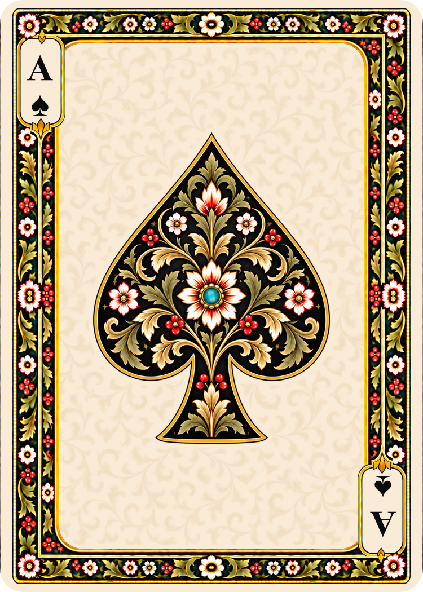
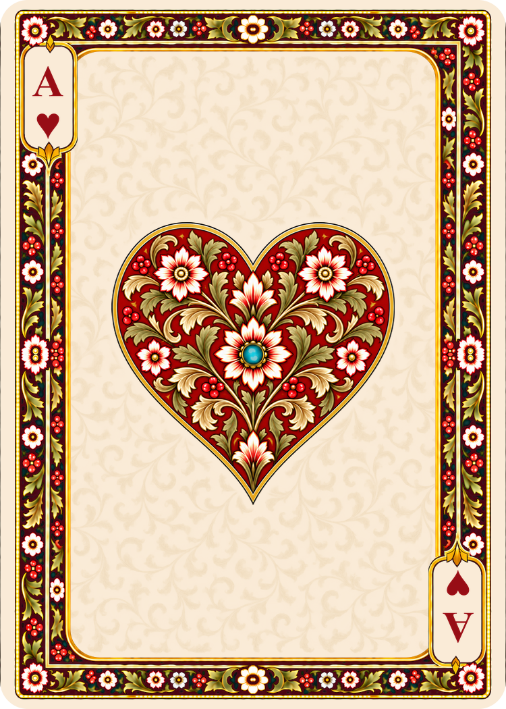
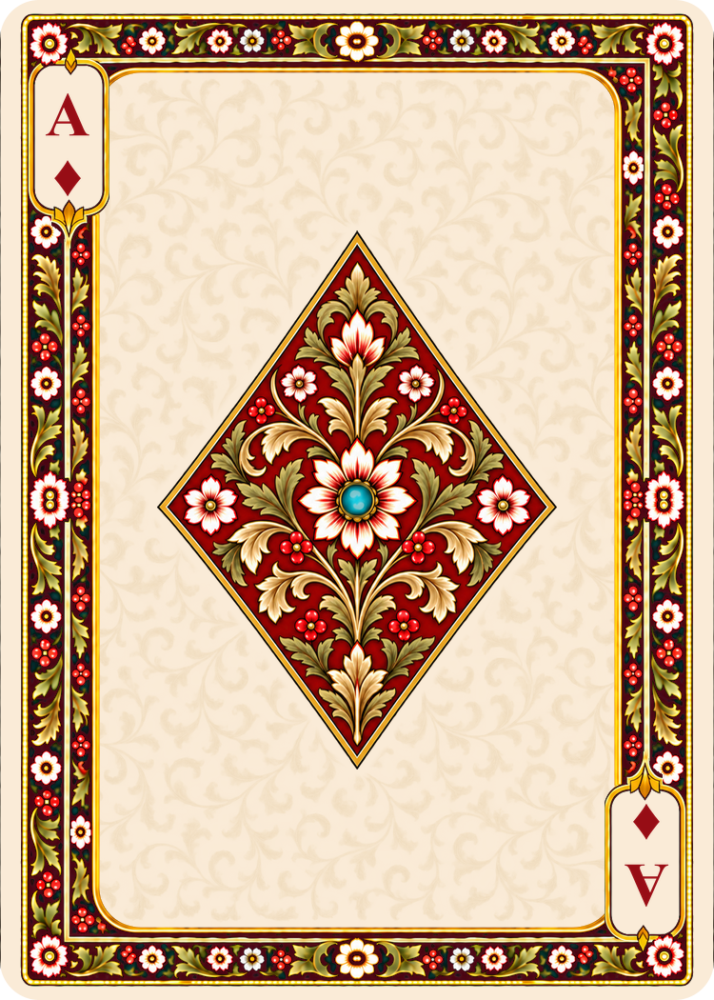
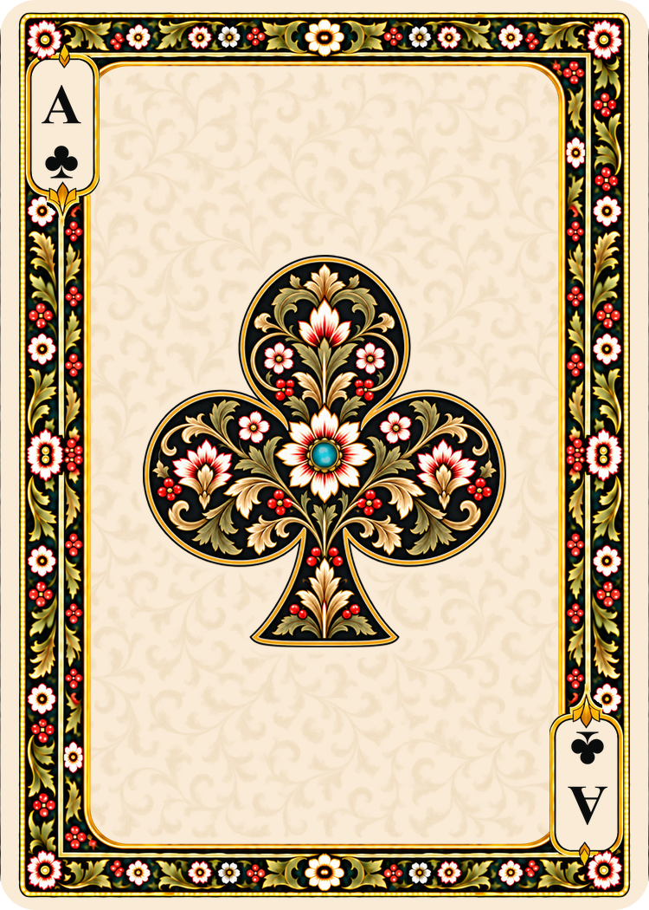

# Poker aces

Four large botanical suit emblems extend the twelve court cards. All four aces use gold and olive foliage, ivory flowers, berries and a central turquoise jewel. Spades and Clubs have black grounds; Hearts and Diamonds have madder-red grounds. Spades fills most of its central ivory field.

Generated using built-in imagegen. [Complete final prompts](poker-aces-prompts.md) and [preparation measurements](ace-preparation.json) are retained.

## Gallery

| Spades | Hearts | Diamonds | Clubs |
| --- | --- | --- | --- |
|  |  |  |  |

## Files and preparation

- Playable assets: `cards/faces/french-suited/poker/<suit>/ace.png`
- Untouched 1060 × 1484 masters: `sources/generated/poker/aces/<suit>.png`
- Final exports: **750 × 1050, nominal 300 DPI**, for 2.5 × 3.5 inch trim size.
- Central jewel anchor: **(375, 525)** in zero-based pixel coordinates, measured by rounding the turquoise jewel's chroma-weighted centroid. The painted jewel's subpixel centroid is recorded separately.

`scripts/prepare_aces.py` uses the established Lanczos export helper. It then translates each central emblem by whole pixels. Displacement tapers through the surrounding ornament to keep the outer frame and corner cartouches fixed; only that transition uses bilinear resampling. Pixels inside the full-displacement central region retain their exact exported values. This is deterministic image processing, not a second generative painting pass.

The four aces share identical perimeter pixels outside the protected interior and corner index panels, taken from the Spades ace export. Their frame follows the court cards' botanical vocabulary but is a separate ace template: copying the court template created visible joins because the inner outlines differed. The approved courts and backs are unchanged.

To stage a reproducible preparation from the masters:

```text
python scripts/prepare_aces.py
```

Inspect `work/ace-preparation/preview-final.png`. The optional `--apply` installs new files and refuses to overwrite existing aces. The JSON report includes source/output hashes, centroid measurements and shifts.

## Verification and scope

Verified all four output dimensions and DPI, jewel anchors, shared ace border pixels, and unchanged source masters. The catalog check covers all 46 playable image files. All 42 previously cataloged backs and courts remain byte-for-byte unchanged.

These are single upright suit emblems with opposing corner indices. They are not intended to have half-turn symmetry in the central illustration. No manufacturer text, logo, tax stamp, bleed, cut marks or gutters were added.

The collection now contains **16 of 52 standard faces**. The 36 numeral cards and two planned jokers remain.
