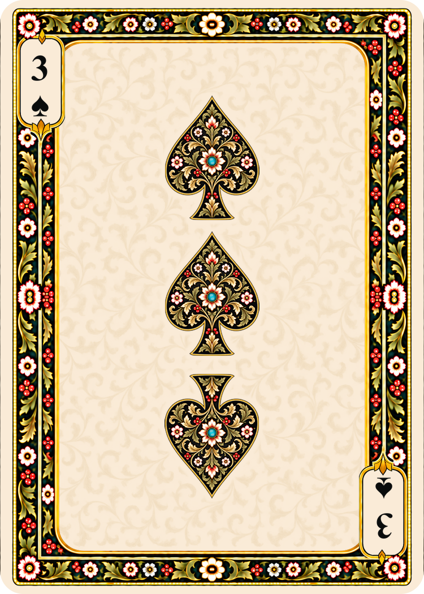

# Gilded vine tracery for non-court fronts

The background is fine arabesque scrollwork with acanthus leaves, printed as
a light trace of muted antique gold ink on the deck's antique ivory. The
color and visibility were approved on the fine-scale card preview. The
production template keeps that source and 26% opacity, with a further 15%
reduction in the size of the ornament for finer granularity.

The artwork is a continuous field of many small branching scrolls rather than
separately stamped sprigs. It applies to aces, numerals, and Jokers in all five
face formats. Pips, corner indices, frame artwork, court paintings, and backs
retain their established designs and placements.

## Source and controls

- [Ornament master](../../sources/components/front-tracery-v3/ornament-master.png):
  approved generated RGBA artwork, retained without recoloring.
- [Template settings](../../sources/components/front-tracery-v3/template.json):
  opacity, scale, and center blending.
- [Generation prompt](../../sources/components/front-tracery-v3/generation-prompt.json):
  exact prompt used with the built-in image_gen tool and its style-review record.

The renderer downsizes the ornament to 85% of the destination canvas and
continues its edges into the outer margins by reflection. It registers the
lower half to the upper half under a 180-degree rotation. An 8%-height center
band blends premultiplied color and alpha, preserving the ink strength without
a hard join. The existing soft artwork halos and field mask are applied after
the ornament layer is built. European Standard continues to derive from Bridge.

## Front templates and example

[Lamp Black blank front](front-tracery-v3-template-black.png) ·
[Madder Lake blank front](front-tracery-v3-template-red.png)

## Reproduction

Use `python scripts/expand_faces.py --stage` to rebuild from the saved source,
then `python scripts/expand_faces.py --apply` to validate and promote the stage.
The ordinary stage/apply cycle makes no image-generation calls. The full
validation checks inventory, source hashes, image reproduction, pip positions,
clipping, silhouettes, and declared half-turn symmetry. A regression check
also verifies that symmetry holds across native sizes and that the center
blend does not exceed the approved ink opacity.

Validation of this revision: all 16 unit tests passed, followed by the full
300-image render and geometry validation. Exactly 210 non-court faces changed;
all 60 court faces and 30 backs are byte-identical to the preceding active set.
The card catalog and render report contain the promoted file hashes. Visual
review covered all five formats, the blank templates, sparse and dense numeral
cards, and the Travel Ace of Diamonds.
