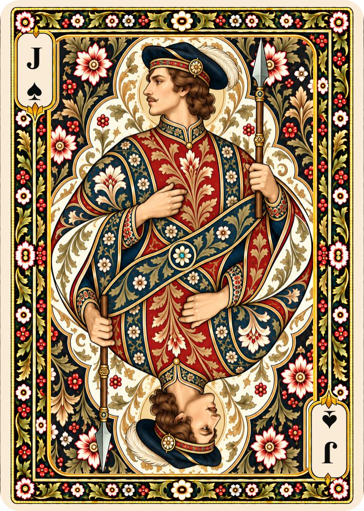
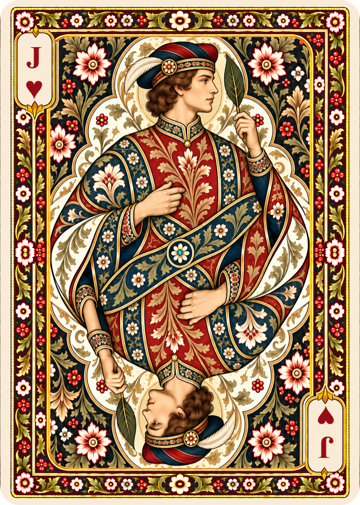
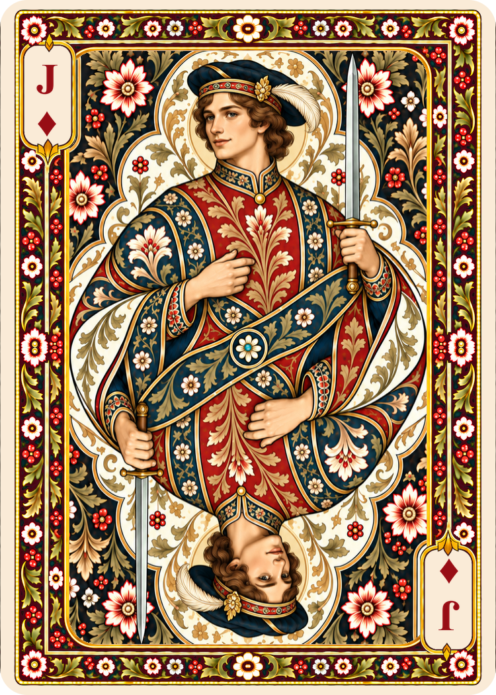
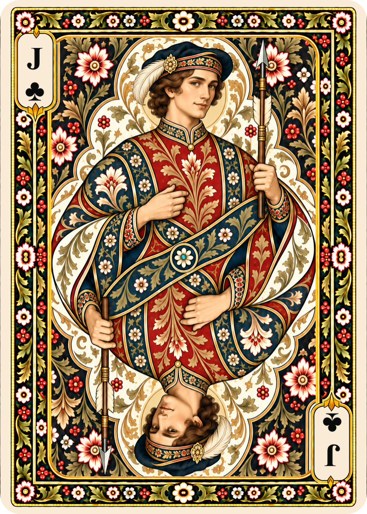

# Poker jacks

Four jacks extend the existing kings and queens, completing the 12 court cards. Artwork was generated with built-in imagegen; [complete prompts](poker-jacks-prompts.md) are preserved.

## Gallery

| Spades | Hearts | Diamonds | Clubs |
| --- | --- | --- | --- |
|  |  |  |  |

## Design decisions

The supplied latest brief determines the facing directions and held attributes. Historical card patterns vary; these are new illustrations within the existing deck, not reconstructions of a specific dated pack. For background on the changing attributes and poses, see [IPCS: court design](https://i-p-c-s.org/faq/tmfaq2.php). Paris-pattern character names are not printed on the cards.

| Suit | Upper portrait | Attribute |
| --- | --- | --- |
| Spades | Left-facing profile, one visible eye, small moustache | Upright infantry pike |
| Hearts | Right-facing profile, one visible eye, clean jaw | Raised olive leaf beside the head |
| Diamonds | Slight leftward three-quarter view, both eyes visible | Slender straight sword |
| Clubs | Slight rightward three-quarter view, both eyes visible | Arrow-like shaft with point and cream fletching |

Young adult figures and soft feathered caps distinguish jacks from crowned kings and queens. The beaded frame, dark floral border, ivory/gold medallion, botanical garments, center rosette and palette remain consistent. J indices are black on Spades/Clubs and red on Hearts/Diamonds. All faces pair with every poker-back color.

## Files and export

- Current assets: `cards/faces/french-suited/poker/<suit>/jack.png`
- Untouched generated masters: `sources/generated/poker/jacks/<suit>.png`
- Export helper: `scripts/export_face.py`

The generator returned 1060 × 1484 PNGs despite a 750 × 1050 request. The user explicitly authorized standard resizing while retaining the masters. Exports use Pillow Lanczos resampling to 750 × 1050, preserving the exact 5:7 aspect ratio and setting nominal 300-DPI metadata. There is no cropping, stretching, recoloring or further painting. Source SHA-256 hashes are embedded in the exports.

To export a master to a new path:

```text
python scripts/export_face.py sources/generated/poker/jacks/spades.png build/digital/spades-jack.png
```

The script refuses existing destinations and mismatched aspect ratios. Current PNGs print at 2.5 × 3.5 inches at 300 PPI. PNG density encoding may read as 299.9994 DPI.

## Verification and limits

All four exports were visually checked at final size for J/suit legibility, suit colors, profile versus two-eye poses, hand/attribute readability, cap clearance, frame and palette. Export checks verify dimensions and DPI and ensure masters are unchanged; the catalog records output hashes and geometry. All 38 previously cataloged images were verified unchanged before adding these jacks.

These remain review artwork. As with the kings and queens, painted ornament and opposing portraits are not pixel-identical repeats. The export process does not impose exact rotational symmetry or add bleed, cut marks or print-sheet layouts.

A subsequent [court alignment pass](court-alignment.md) registered all twelve courts to the same dot anchor and replaced their perimeter ornament with a shared existing border. The current jack PNGs therefore include that alignment after the initial export; pre-alignment exports are preserved with the other courts under `sources/before-court-alignment/`.

After this pass: 12 of 52 standard faces, with 40 aces/numeral faces still to create. Two jokers would bring the planned standard deck to 54.
