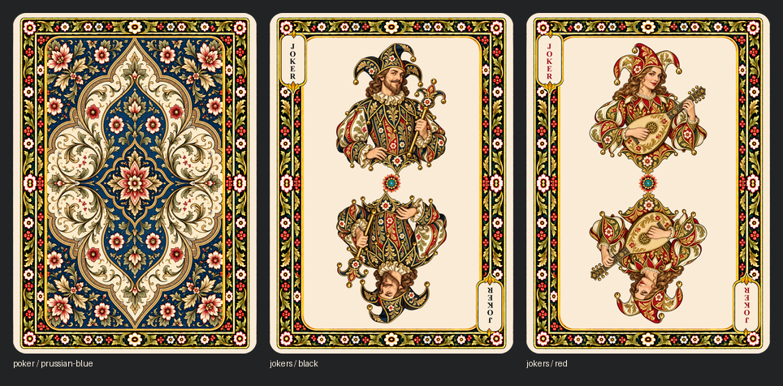

# Poker completion v2

September 17, 2026. The collection now contains **54 poker faces and 30 backs**.
This follow-up replaces the temporary back cartouches from the initial rebuild
with a dedicated continuous frame and adds two Jokers. The existing 52 suited
faces retain their pixels and geometry.



## Dedicated back template

`sources/components/poker/v2/back-frame.png` is derived from the same generated
panel-free perimeter used to build the face frame. It omits the face-cartouche
overlay entirely. The template and its independent field mask are versioned,
pixel-exact under a half-turn, and have the established antique-white ground
and 3.5 mm corner mask. There are no blank panels or replacement medallions.

All five colors in all six formats are assembled from that template and the
existing registered botanical back patterns. Reproduction requires no new image
generation. The original patterned interiors, palette recipes, and center
registration are retained; the former cartouche areas now show uninterrupted
botanical ornament and the intended inner field.

## Jokers

The black Joker is an illustrated jester carrying a bauble staff. The red
Joker is an illustrated jester playing a lute. Both use the established botanical
palette and portrait style. Their upright transparent masters were created
with the built-in image-generation tool. Masters and exact prompts are saved
under `sources/generated/poker-completion-v2/`.

Each upright component is placed at (374.5, 302.5). Its lower partner is the
exact 180-degree rotation at (374.5, 746.5). A shared floral jewel sits at
(374.5, 524.5). Opposing vertical JOKER indices use the same face cartouches.
The completed Jokers are pixel-exact under a half-turn.

Active paths are `cards/faces/french-suited/poker/jokers/black.png` and `red.png`.
Their catalog rank is `joker`, suit is null, and `color_variant` distinguishes
them. They do not add a fifth suit. The gallery groups and labels them separately.

## Release artifact

`python scripts/package_poker.py --build` produces
`build/releases/design1-poker.zip` and an unpacked sibling directory. The root
has `backs/` (five files) and `faces/` (54 files, flattened descriptive names),
a detailed README, license, manifest, and SHA-256 list.

Two print variants live under `print/bleed/` and `print/guides/`, each with
its own `backs/` and `faces/`. Clean bleed PNGs are 1650 x 2250 at 600 ppi,
with exact 1/8-inch margins around 2.5 x 3.5 inch trim. Guide PNGs are
1800 x 2400 at 600 ppi with an additional 1/8-inch white slug and faint blue
rounded cut outlines/crop marks. Blue guides are for proofing/manual cutting,
not ordinary final printer uploads. All print images are opaque, tagged sRGB.

Print export uses exact 2x replication of 300-ppi source pixels; it adds no
detail and makes no generation calls. The 600-ppi canvas avoids the half-pixel
offset otherwise needed for exact 1/8-inch margins at 300 ppi. Native trim
PNGs are copied byte-for-byte into the archive.

The packaged README specifies all coordinates, safe-area guidance, bleed vs
gutter vs slug, back/face pairing, original detail density, color handling,
physical cutting tolerances, and differing printer templates. This is a
general print-preparation package, not a vendor-certified press job, imposed
sheet, or PDF/X export. The ZIP is built locally; no GitHub release is published.

## Validation and reproduction

```text
python scripts/complete_poker.py --prepare
python scripts/rebuild_deck.py --stage
python scripts/rebuild_deck.py --check
python scripts/rebuild_deck.py --apply
python scripts/catalog.py --check
python -m unittest discover -s scripts -p "test_*.py"
python scripts/package_poker.py --build
python scripts/package_poker.py --check
```

Normal staging uses saved components and needs no font or image service.
Component preparation uses Windows Times New Roman Bold for the saved Joker
index rasters. The completion component hashes are in
`poker-completion-v2-components.json`; active validation is recorded in
`poker-completion-v2-report.json`. The original v1 report remains historical.

Checks cover all 84 assets, frame/outline equality, every numeral jewel,
count, orientation, overlap/clipping, Joker indices/center/paired portraits,
and exact whole-card reversibility where declared. Package validation checks
all 177 PNGs, unchanged native bytes, exact print trim pixels/margins, color
profiles, cut-guide placement, ZIP CRCs, and per-file SHA-256 hashes. Regression
tests include absence of back-panel cutouts and a one-pixel print-placement test.

All 82 pre-completion images and the prior catalog/configuration are preserved
with hashes in `sources/before-poker-completion-v2/`.
