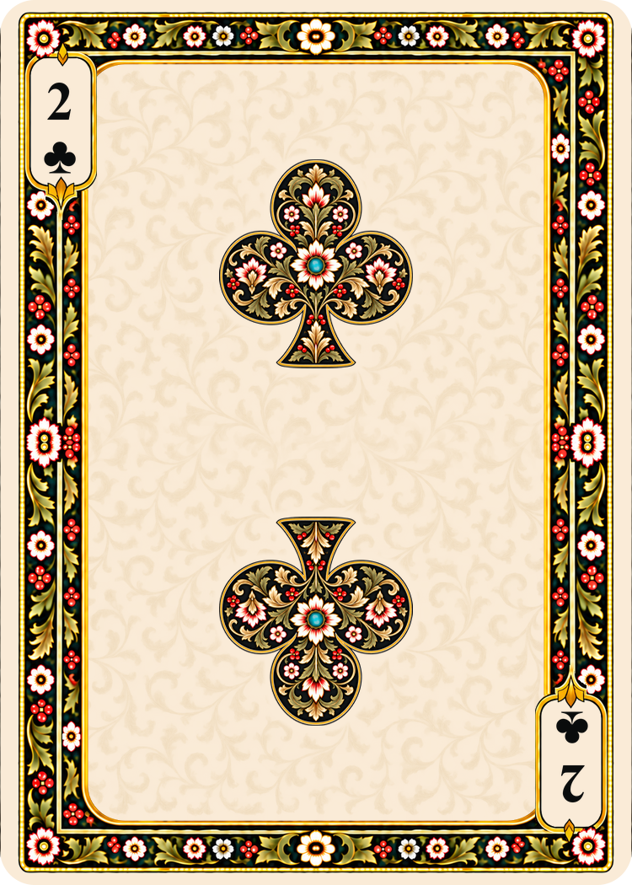

# Wide-panel twos — enlarged ornate pips

Generated September 16, 2026 with the built-in image generation tool. Each suit's current ten was the edit reference. These four twos use the wide ivory panel and larger central botanical emblems requested by the user, superseding the earlier same-size-pip proposals.

The 1060 × 1484 generated masters are retained under `sources/generated/poker/numerals/wide-twos/`. The standard export helper creates 750 × 1050 PNGs at nominal 300 DPI without cropping or stretching. Each card was visually checked for two central pips, correct suit silhouettes, corner 2 indices, and spacing. Lower hearts, spades and clubs are inverted; diamond ornament received a corrective generation but exact ornament repetition and half-turn symmetry remain approximate. Frames are generatively matched, not pixel-identical.

| Hearts | Spades | Diamonds | Clubs |
| --- | --- | --- | --- |
|  |  |  |  |

## Prompts

### hearts

```text
Use case: precise-object-edit. Convert the provided TEN OF HEARTS into a matching TWO OF HEARTS for this illustrated deck. Input image is the edit target and exact frame/style reference.
Preserve the broad rounded rectangular ivory playing field, pale champagne-gold botanical filigree, narrow dark floral perimeter, gold lines and beads, all floral colors, rounded ivory outer edge, corner cartouche locations and 5:7 canvas.
Replace the ten ornate middle pips with EXACTLY TWO ornate hearts pips, aligned on vertical centerline x=50%, centered at y=32% and y=68%. Make each pip approximately 40% larger in linear dimensions than a single pip in the ten: target about 25% of card width, with proportional height. Two moderately enlarged pips with ample ivory space between them. Preserve the ace-style gold and olive foliage, ivory/red blossoms, berries, turquoise jewel in ivory rosette, double gold contour and visible suit-colored ground. Upper pip upright; lower complete emblem including internal ornament rotated 180 degrees, identical size. Clear all vacated pip positions with ivory and matching faint filigree. No ghost pips or extra emblems.
SUIT: Deep madder-red hearts with two rounded lobes and a deep notch, no stems. Upper notch up/point down; lower point up/notch down. Red corner numeral and solid red corner heart.
Replace each corner serif "10" with a single serif "2", same cap height and color, gracefully centered in existing cartouche. Small corner suit marks remain SOLID. Bottom-right whole 2/suit index pair is rotated 180 degrees. Exactly two numeral 2 labels, two solid small corner suit marks, and TWO central ornate pips. No 10, A, other text or center standalone decoration.
Preserve the reference's frame and broad panel design; no lobed field. One flat full card, 1060x1484 pixels, exact 5:7 portrait, no crop, no external background or mockup.
```

### spades

```text
Use case: precise-object-edit. Convert the provided TEN OF SPADES into a matching TWO OF SPADES for this illustrated deck. Input image is the edit target and exact frame/style reference.
Preserve the broad rounded rectangular ivory playing field, pale champagne-gold botanical filigree, narrow dark floral perimeter, gold lines and beads, all floral colors, rounded ivory outer edge, corner cartouche locations and 5:7 canvas.
Replace the ten ornate middle pips with EXACTLY TWO ornate spades pips, aligned on vertical centerline x=50%, centered at y=32% and y=68%. Make each pip approximately 40% larger in linear dimensions than a single pip in the ten: target about 25% of card width, with proportional height. Two moderately enlarged pips with ample ivory space between them. Preserve the ace-style gold and olive foliage, ivory/red blossoms, berries, turquoise jewel in ivory rosette, double gold contour and visible suit-colored ground. Upper pip upright; lower complete emblem including internal ornament rotated 180 degrees, identical size. Clear all vacated pip positions with ivory and matching faint filigree. No ghost pips or extra emblems.
SUIT: Black spades, pointed tip and flared stem. Upper point up/stem down; lower point down/stem up. Black corner numeral and solid black corner spade.
Replace each corner serif "10" with a single serif "2", same cap height and color, gracefully centered in existing cartouche. Small corner suit marks remain SOLID. Bottom-right whole 2/suit index pair is rotated 180 degrees. Exactly two numeral 2 labels, two solid small corner suit marks, and TWO central ornate pips. No 10, A, other text or center standalone decoration.
Preserve the reference's frame and broad panel design; no lobed field. One flat full card, 1060x1484 pixels, exact 5:7 portrait, no crop, no external background or mockup.
```

### diamonds

```text
Use case: precise-object-edit. Convert the provided TEN OF DIAMONDS into a matching TWO OF DIAMONDS for this illustrated deck. Input image is the edit target and exact frame/style reference.
Preserve the broad rounded rectangular ivory playing field, pale champagne-gold botanical filigree, narrow dark floral perimeter, gold lines and beads, all floral colors, rounded ivory outer edge, corner cartouche locations and 5:7 canvas.
Replace the ten ornate middle pips with EXACTLY TWO ornate diamonds pips, aligned on vertical centerline x=50%, centered at y=32% and y=68%. Make each pip approximately 40% larger in linear dimensions than a single pip in the ten: target about 25% of card width, with proportional height. Two moderately enlarged pips with ample ivory space between them. Preserve the ace-style gold and olive foliage, ivory/red blossoms, berries, turquoise jewel in ivory rosette, double gold contour and visible suit-colored ground. Upper pip upright; lower complete emblem including internal ornament rotated 180 degrees, identical size. Clear all vacated pip positions with ivory and matching faint filigree. No ghost pips or extra emblems.
SUIT: Deep madder-red true diamond rhombi, four straight sides and four sharp apexes, NO stems, necks, caps or lobes. Lower internal floral artwork fully inverted. Red corner numeral and solid red corner diamond.
Replace each corner serif "10" with a single serif "2", same cap height and color, gracefully centered in existing cartouche. Small corner suit marks remain SOLID. Bottom-right whole 2/suit index pair is rotated 180 degrees. Exactly two numeral 2 labels, two solid small corner suit marks, and TWO central ornate pips. No 10, A, other text or center standalone decoration.
Preserve the reference's frame and broad panel design; no lobed field. One flat full card, 1060x1484 pixels, exact 5:7 portrait, no crop, no external background or mockup.
```

### clubs

```text
Use case: precise-object-edit. Convert the provided TEN OF CLUBS into a matching TWO OF CLUBS for this illustrated deck. Input image is the edit target and exact frame/style reference.
Preserve the broad rounded rectangular ivory playing field, pale champagne-gold botanical filigree, narrow dark floral perimeter, gold lines and beads, all floral colors, rounded ivory outer edge, corner cartouche locations and 5:7 canvas.
Replace the ten ornate middle pips with EXACTLY TWO ornate clubs pips, aligned on vertical centerline x=50%, centered at y=32% and y=68%. Make each pip approximately 40% larger in linear dimensions than a single pip in the ten: target about 25% of card width, with proportional height. Two moderately enlarged pips with ample ivory space between them. Preserve the ace-style gold and olive foliage, ivory/red blossoms, berries, turquoise jewel in ivory rosette, double gold contour and visible suit-colored ground. Upper pip upright; lower complete emblem including internal ornament rotated 180 degrees, identical size. Clear all vacated pip positions with ivory and matching faint filigree. No ghost pips or extra emblems.
SUIT: Black clubs with three ROUND lobes and a short flared stem. Upper round lobe up/stem down; lower stem up/round lobe down. Black corner numeral and solid black corner club.
Replace each corner serif "10" with a single serif "2", same cap height and color, gracefully centered in existing cartouche. Small corner suit marks remain SOLID. Bottom-right whole 2/suit index pair is rotated 180 degrees. Exactly two numeral 2 labels, two solid small corner suit marks, and TWO central ornate pips. No 10, A, other text or center standalone decoration.
Preserve the reference's frame and broad panel design; no lobed field. One flat full card, 1060x1484 pixels, exact 5:7 portrait, no crop, no external background or mockup.
```

### Diamond ornament correction

```text
Use case: precise-object-edit. Correct ONLY the internal ornament of the LOWER diamond on this Two of Diamonds. It is currently upright. Replace that lower diamond emblem with an exact 180-degree rotated copy of the UPPER diamond emblem, including all flowers, berries, leaves and gold outline. The large tulip-shaped flower and its broad olive leaves currently at the top of the upper pip must appear upside-down at the BOTTOM of the lower pip. Preserve the lower pip's center position and overall size. Preserve the entire card's frame, pale ivory filigree background, colors, corner 2/diamond indices, upper diamond, and exact 5:7 canvas. Still exactly two central diamonds, same size as current. No other changes. Output 1060x1484 pixels.
```

