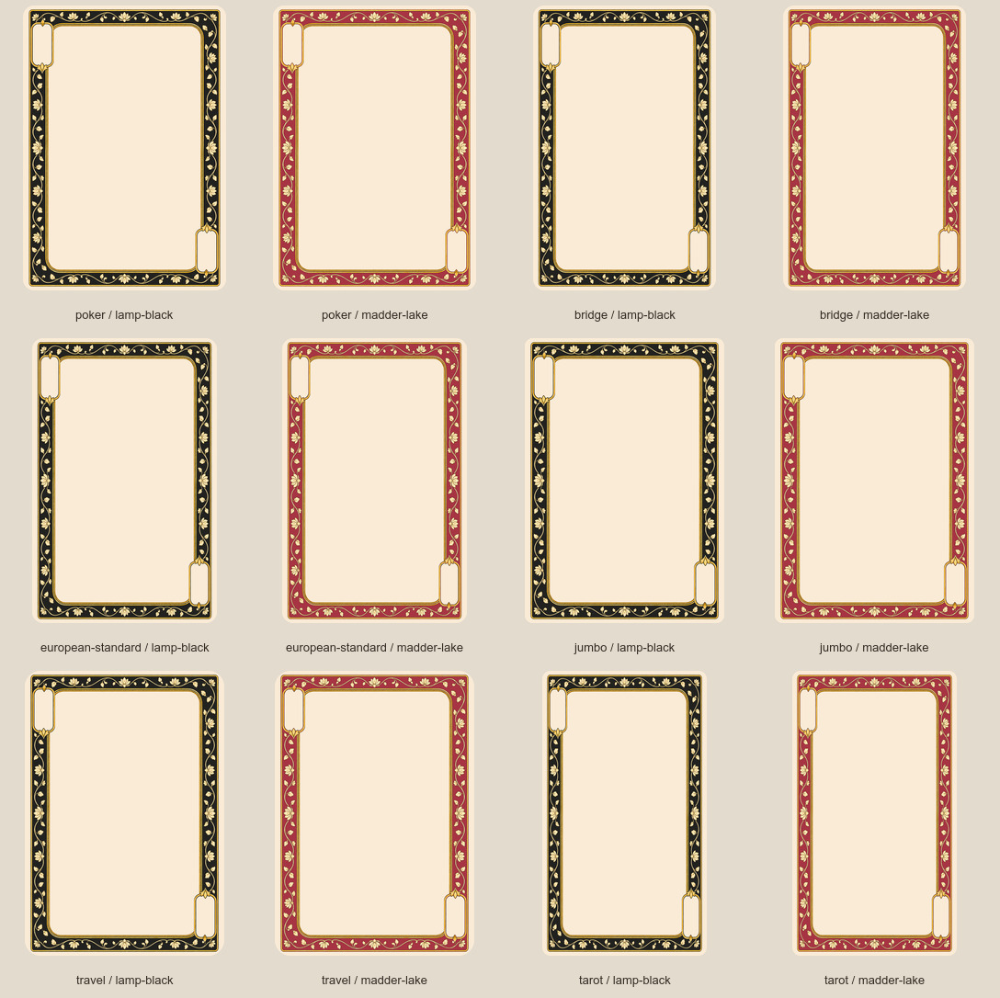

# Design 2 face frames

Twelve reusable blank fronts: Lamp Black and Madder Lake in Poker, Bridge,
European Standard, Jumbo, Travel, and Tarot sizes. The fine gold lotus vines
and beaded inner rule follow Design 2's approved silk-floral backs.



## What carries over from Design 1

Design 1's `scripts/rebuild_deck.py` prepares a shared generated frame with
separate masks for the central artwork field, the two diagonal index panels,
and the rounded card outline. `scripts/expand_faces.py` places artwork through
the field mask, then adds independent rank/suit indices. Its frame palette
follows the suit: Lamp Black for spades/clubs and the black Joker; Madder Lake
for hearts/diamonds and the red Joker. Fine interior tracery is a separate
layer used for non-court artwork, not part of the structural frame.

Design 2 adopts that component arrangement. Its center and index panels are
flat antique white (`#FAEBD7`), ready for later artwork and lettering. It uses
its own lotus ornament and palette values (`#21211F` and `#A73443`). The gold
ink and geometry are identical across the two colors. There are no ranks,
suits, portraits, pips, or interior tracery baked into these templates.

## Files and composition

Components live in
[`sources/components/design2-face-frames-v1/`](../../sources/components/design2-face-frames-v1/).
Each format contains:

- `lamp-black.png` and `madder-lake.png`: full-size RGBA blank fronts, 300 ppi.
- `field-mask.png`: white admits central artwork; black protects the frame.
- `panel-mask.png`: the two blank index cartouches, separate from the artwork.
- `frame-color-mask.png`: the variable border ground; gold is protected.
- `outline-mask.png`: the collection's 3.5 mm physical rounded silhouette.

The [manifest](../../sources/components/design2-face-frames-v1/manifest.json)
records dimensions, exact centers, exclusive-right/bottom bounds, a safe
upper-left index rectangle, palette policy and all file hashes. Rotate the
upper-left index layer 180 degrees for the lower-right index. Composite a
full-canvas artwork layer through `field-mask.png`, place indices within the
panel masks, then retain/reapply `outline-mask.png` as the final alpha.

Like Design 1, the faces use a shared Poker composition resampled with its
masks for each format. European Standard derives from Bridge. These are not
independent format-specific generations, and the ornament/band proportions
scale with the canvas. Unlike the back renderer, this renderer does not
enforce a constant 50-pixel band. Every saved frame and mask has exact
half-turn symmetry, including odd-sized canvases. A narrow center blend
registers the source vines without a hard splice.

These are component templates, not finished cards, so they are kept outside
`cards/` and the finished-card catalogs. The Tarot-sized pair is also blank;
Tarot titles and suit-specific layouts remain future face artwork work.

## Reproduce and verify

From the repository root:

```text
node designs/design2/scripts/build_face_frames.mjs
python designs/design2/scripts/audit_face_frames.py
python scripts/catalog.py --check
python scripts/check_layout.py
```

Rebuilding uses the saved master and makes no ImageGen calls. Node.js and
ImageMagick are required; the audit uses the repository's Python dependencies.
The audit independently checks file hashes, dimensions, density, physical
alpha, symmetry, clear interiors, index containment, and palette isolation.

The artwork was created with built-in `image_gen`, using Design 1's blank
frame as the structural reference and Design 2's approved Prussian Blue back
as the style reference. The unmodified
[master](../../sources/generated/design2-face-frames-v1/frame-master.png) and
[exact prompt](../../sources/generated/design2-face-frames-v1/prompts.json)
are retained in the repository.
