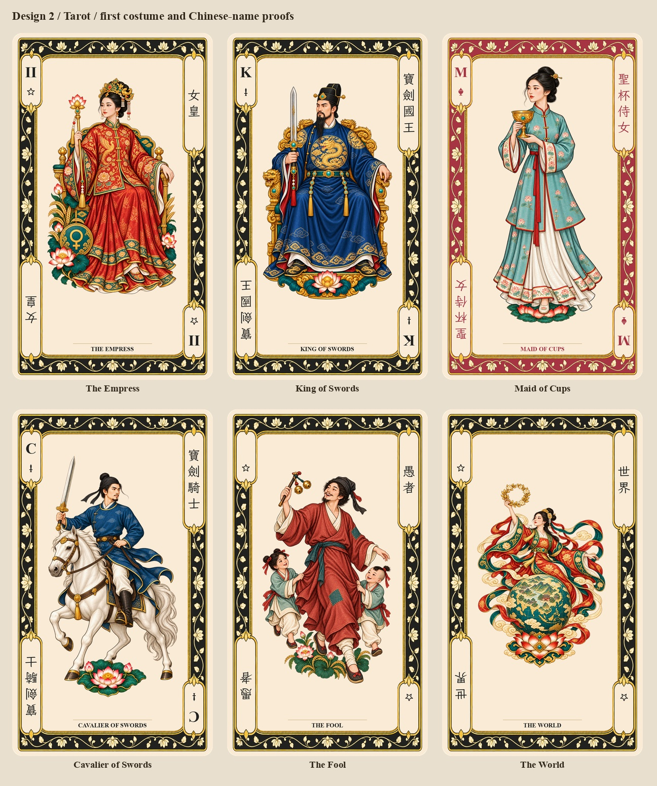

# Design 2 Tarot faces: first layout and costume release

Started 2026-09-29. Tarot is the separate **825 × 1425**, **2.75 × 4.75 in**
deck, using the 97-card Minchiate inventory. Poker retains its 54 French-suited
faces. Minchiate is the Tarot tradition, not another size or a subset of Poker.

[Browse Tarot](../../tarot.html) ·
[First costume/lettering proofs](../../tarot.html#design=design2&size=tarot&set=first-proofs)

## Current state

All 97 faces are composed from separate illustration components at native
Tarot dimensions. The frame, indices and lettering are separate layers;
finished Poker-sized card images are never stretched into Tarot faces.
The illustration's aspect ratio is preserved while fitting and centering its
painted visual mass in the tall aperture. Pip placements are laid out for the
taller field. The center is `(412, 712)`.

This is a complete **layout review**, not final approval of all costumes or
Chinese translations. Five illustration revisions establish the costume
families: Empress, King of Swords, Maid of Cups, Cavalier of Swords and Fool.
World uses the previously revised Chinese flying-figure illustration. The
remaining illustrations carry forward for subsequent costume and object
review. Earlier masters and exports are preserved.

## Frame and names

One new built-in ImageGen template retains the short upper-left and lower-right
index panels and adds taller upper-right and lower-left Chinese name panels.
Its top half is registered to the bottom by a half-turn; its native output is
prepared into Lamp Black and Madder Lake frame components and independent
artwork, index, name and outline masks. The physical alpha silhouette matches
the existing Tarot back exactly. No claim is made that every floral detail of
the face and back is identical.

The Chinese names use traditional characters typeset in **LXGW WenKai TC
Regular 1.522**, a readable handwritten font. Each upper-right name is a
top-to-bottom column of upright characters; its lower-left counterpart rotates
as a complete layer through 180 degrees. Names are 52 px with a 66 px step,
consistent throughout the deck. The longest working titles have four
characters and fit without switching to simplified Chinese.

The font and its SIL OFL license are stored under `sources/fonts/`; it is used
by the renderer without installation. English titles and existing Roman/rank
indices are preserved. Minchiate Time, Trumpets and House of the Devil retain
their own identities rather than inheriting titles from another Tarot system.
The [editable translations](tarot-names-zh-Hant.json) need Chinese-language
editorial review; conventional Tarot wording does not settle every Minchiate
translation. The gallery supports both English and Chinese search.

## Costume proofs



- Empress: a center-fastened standing-collar phoenix jacket over a separate
  skirt, replacing the oversized generic shoulder stole.
- King of Swords: mineral-blue round-collared robe, gold dragon roundels and
  black court headwear in place of the fantasy crown and open stole.
- Maid of Cups: pale-teal jacket, sparse lotus repeats and simple pinned hair.
- Cavalier of Swords: secured blue riding robe, narrower sleeves, trousers,
  dark boots and cloth headwear.
- Fool: plain patched garments and a soft cap; children's clothing is simpler.
- World: its selected flying figure, ribbons, globe and Chinese landscape.

These are contemporary card interpretations informed by the
[costume reference guide](costume-and-textile-direction.md), not verified
reconstructions of named historical outfits. The generated Empress proof
establishes the jacket/skirt separation; exact pleat and tailoring details
remain part of visual review.

## Files and reproduction

Active faces: `cards/faces/tarot/tarot/`. Components, masks and proof copies:
`sources/components/tarot-faces-v1/`. Original generated revisions and
[exact prompts](../../sources/generated/tarot-faces-v1/prompts.json):
`sources/generated/tarot-faces-v1/`.

The superseded 750 × 1050 exports are retained byte-for-byte under
`sources/components/tarot-faces-v1/previous-poker-exports/`, with their old
paths and hashes recorded in `manifest.json`. Existing source illustrations
and the older Poker-size construction report remain historical records.
The previous review URL now opens the current Tarot viewer. The old generator
cannot promote Poker-sized Tarot cards back into the active inventory.

From the repository root:

```text
python designs/design2/scripts/render_tarot_faces.py
python designs/design2/scripts/render_tarot_faces.py --check
python designs/design2/scripts/render_tarot_faces.py --apply
python designs/design2/scripts/render_tarot_faces.py --check --active
python scripts/catalog.py --write
python scripts/build_gallery.py --write
```

`--apply` first reproduces and checks a complete saved 97-card review set,
archives superseded exports if present, then copies the checked faces into
the active Tarot directory and updates the design manifest. Subsequent source
revisions require rebuilding the review set before promotion. Checks cover
input hashes, saved pixels, native dimensions, 300 ppi metadata, silhouette,
index/name containment, protected frame pixels, pip instance counts and
painted-mass centering error below 0.2 px. Cultural and translation review are
separate from these geometry checks.
