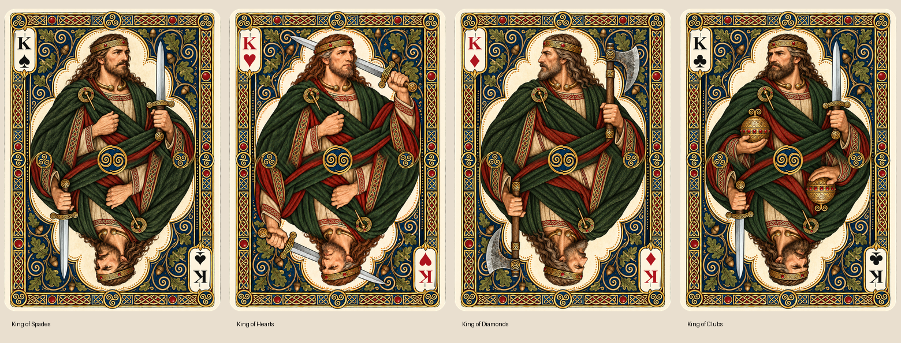

# Official Celtic Poker Kings — registration v1

The user approved the four rugged King paintings and requested official versions
with a common center and consistent borders. Four production PNGs now live under
`cards/faces/french-suited/poker/<suit>/king.png`. No new figures were generated.



The release uses 750 × 1050 RGBA at nominal 300 ppi, 2.5 × 3.5 inch trim,
and the collection's 3.5 mm rounded alpha mask. It contains trim artwork without
bleed, crop marks or imposition.

## Registration

- One shared frame derives from the approved Spades painting. Frame pixels are
  identical outside the interior and suit-specific index ink.
- Consistent K and French suit indices replace the generated ink inside the same
  cream panels. Times New Roman Bold supplies the glyphs; black identifies Spades
  and Clubs, red identifies Hearts and Diamonds.
- The source medallion's gold rim is fitted to locate each painting's waist. A
  recorded piecewise mapping registers the art around that point, accommodating
  the slightly different Spades source dimensions.
- The upper portrait supplies its exact rotated lower partner. A 49-pixel
  complementary blend through the robe at the waist prevents a sharp cloth join.
- A shared 104 × 104 painted center medallion uses the Spades ornament's left
  half and its rotated partner, yielding opposite spiral orientations. Its bounds
  `(323, 473, 427, 577)` put the alpha centroid exactly at `(374.5, 524.5)`.
- Shared side roundels use one painted Spades triskele and its rotated partner;
  their centers lie on the same horizontal waist axis.

The identifying upper portraits and objects are preserved: Spades' upright sword,
Hearts' bare upper lip and sword behind the head, Diamonds' profile and axe, and
Clubs' sword and orb. All lower attributes now follow their upper partners exactly.

Generated masters retain their original bytes and SHA-256 hashes. Intermediate
Hearts repairs and the earlier court studies remain archived outside production.
The viewer opens official cards by default and labels source masters separately.

## Reproduce and audit

From the repository root:

```text
python designs/design3/scripts/register_kings.py
python designs/design3/scripts/register_kings.py --apply
python designs/design3/scripts/register_kings.py --check
```

The default stages four cards and a contact sheet under the ignored Design 3
work directory. Apply validates the stage before installing absent or identical
files. Check audits the official cards against the saved source and component
hashes and reconstructs their pixels without writing card files.

The [release manifest](kings-registration-v1.json) records source rim centers,
component hashes, exact medallion bounds and output hashes. The
[audit report](kings-registration-v1-audit.json) verifies shared borders,
the exact medallion center, complete 180-degree pixel equality, the common alpha
mask, 300 ppi encoding, immutable sources and reproducible composition.
