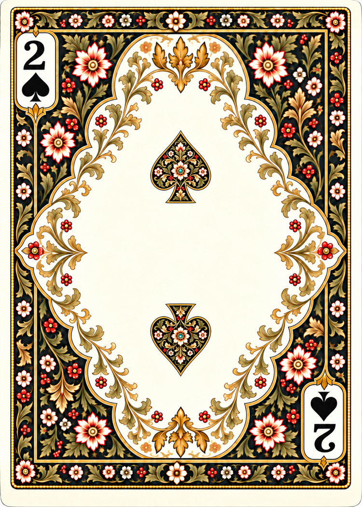
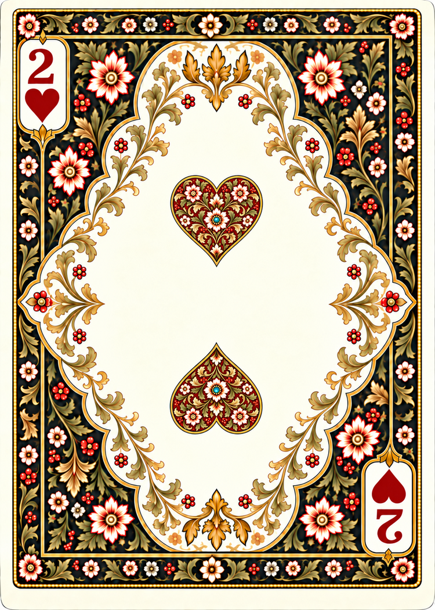
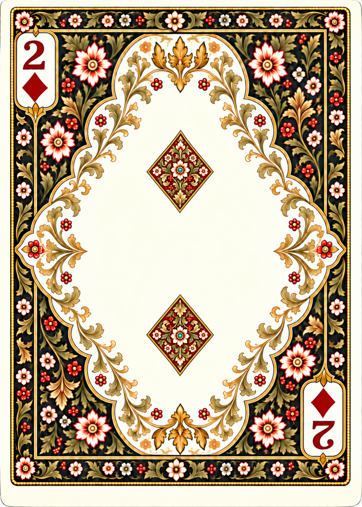
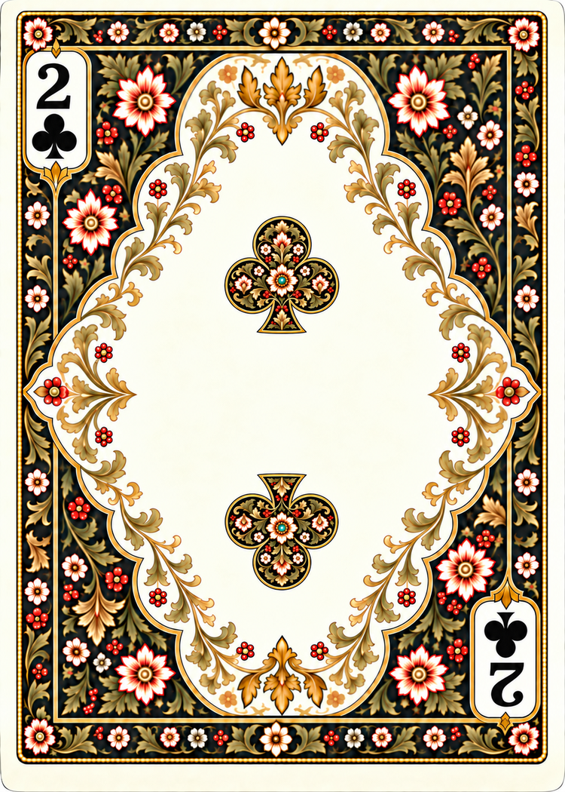

# Poker numeral studies — generation prompts

Built-in image generation, September 16, 2026. Current scope: the four twos, with miniature versions of their respective ornate ace emblems. The user approved the Two of Spades as the direction for the other suits.

The initial solid-pip study is retained at `sources/generated/poker/numerals/spades/2.png`. The user requested miniature ace-style botanical emblems in the center, while keeping the rest of the design. The revised master is `sources/generated/poker/numerals/spades/2-ornate.png`.

## Two of Spades — ornate revision

References: the initial Two of Spades export, then the existing Ace of Spades.

```text
Use case: precise-object-edit.
Create a corrected TWO OF SPADES for Design 1 by editing IMAGE 1.
IMAGE 1: the Two of Spades, EDIT TARGET. Preserve its complete card, exact floral border composition, ivory edge, gold-beaded rectangle, dark botanical surround, lobed ivory inner field with gold/olive scrolls, corner index cartouches, all flowers, berries and all colors.
IMAGE 2: the Ace of Spades, REFERENCE FOR THE INTERIOR OF THE TWO CENTRAL SPADE PIPS ONLY.
CHANGE ONLY THE TWO CENTRAL PIPS in Image 1: each currently plain solid-black central spade must become a miniature of the richly decorated central spade in Image 2. They must contain the same thematic ornament: curling gold and olive acanthus leaves, red-tipped ivory flowers, red berry clusters, and a central ivory rosette with a small turquoise jewel; fine antique gold double outline defining the conventional spade silhouette. Maintain black ground visible between the ornament. These are SMALLER versions of the ace emblem, with equally careful detailed painterly botanical treatment, not flat plain suit symbols.
Keep the two pips centered on the same vertical centerline and at the SAME LOCATIONS as Image 1 (about 50% across, 32% and 68% down). Keep their same overall footprint, approximately 16% card width and 13% card height. Do not enlarge them into two giant aces. The upper spade points upward, stem downward. The entire lower ornate spade is an exact 180-degree rotated counterpart, with point downward, stem upward, including its internal ornament rotated as well. Exactly TWO central decorated spade emblems.
Keep both small CORNER spade symbols SOLID BLACK, and keep both serif '2' indices unchanged. Do not decorate the corner symbols. Do not change either 2 into A.
Preserve the spacious ivory gap between the two middle pips. No central standalone flower or jewel between pips. No additional symbols, text, people, new framing or redesign.
Output ONE complete flat card, portrait 5:7 aspect ratio, 1060x1484 pixels. Same pristine print illustration style and existing composition. This edit is solely replacing the plain fill of the two middle pips with miniature ace-style floral artwork and its fine gold contour.
```

Exported with `scripts/export_face.py` to 750 × 1050 at nominal 300 DPI, preserving the 5:7 aspect ratio. The generated master is retained untouched. The opposing emblems are visually paired; exact repeated ornament and pixel-perfect half-turn symmetry are not claimed. The frame is generatively preserved, not copied pixel for pixel.



Ranks 3–10 have not been generated. Central pips should follow this ornate ace-derived direction; small corner suit marks stay solid.

## Hearts, Diamonds and Clubs

The common layout reference is the approved ornate Two of Spades. Each suit's ace supplies its miniature botanical emblem. All were created using built-in image generation.

### Hearts — initial prompt

```text
Use case: precise-object-edit.
Create the TWO OF HEARTS for Design 1, matching the approved Two of Spades.
IMAGE 1 is the APPROVED TWO OF SPADES, edit target and exact layout/frame/scale reference.
IMAGE 2 is the ACE OF HEARTS, reference for the specific ornate suit emblem to miniaturize.
Preserve Image 1's complete card: thin ivory edge, gold-beaded rectangular outer border, near-black botanical surround with golden olive acanthus, red berries and red-tipped ivory flowers, the lobed ivory inner field and fine gold foliage hugging its boundary. Preserve border motifs, positions, size, line quality and palette. Keep two ivory corner index cartouches in their existing positions. Do not redesign or simplify the frame.
Change ONLY the suit of the two central ornate pips and the two small corner symbols; recolor the two number 2 indices when appropriate. There must be EXACTLY TWO central emblems, at the same positions and miniature scale as Image 1, each on the centerline x=50%, upper about y=33%, lower about y=67%. Keep abundant ivory breathing room and the wide open gap between them. Each central pip is a SMALLER VERSION OF ITS OWN ACE EMBLEM from Image 2, with fine gold double outline, richly curling gold/olive foliage, ivory flowers tipped red, berries, central ivory rosette and one tiny TURQUOISE jewel inside each pip. Preserve suit-colored ground visible among the fine ornament. The user specifically wants miniaturized ace emblems, NOT solid central pips. Match Image 1's pip scale, not Image 2's enormous ace scale.
Upper pip upright; lower pip and all of its internal artwork an identical 180-degree rotated counterpart. Exactly TWO decorated middle pips.
SUIT SPECIFICATION: HEARTS: two conventional deep madder-red HEART silhouettes, each with two rounded lobes, clear central notch and a pointed bottom, no stem. Miniaturize the exact ornate heart in Image 2, retaining its gold/olive curling leaves, red-tipped ivory flowers, berry clusters and central turquoise jewel. Upper heart upright, point downward; lower heart fully rotated 180 degrees, point upward. Each heart approximately 17% of card width and 12% of card height. Both serif 2 indices and small SOLID heart corner symbols deep madder red.
INDICES: bold serif '2' above small solid suit mark top-left, identical complete index pair rotated 180 degrees bottom-right. Preserve numeral font, weight, position and size from Image 1. Exactly two '2' numerals. Keep corner suit marks SOLID, not floral. No A letters or other text.
No new central ornament between pips, no large ace, no people, labels, logos or watermark. Output ONE full flat playing card, exact 5:7 portrait, 1060x1484 pixels. Same meticulous softly shaded botanical print illustration as both reference cards.
```

### Diamonds — initial prompt

```text
Use case: precise-object-edit.
Create the TWO OF DIAMONDS for Design 1, matching the approved Two of Spades.
IMAGE 1 is the APPROVED TWO OF SPADES, edit target and exact layout/frame/scale reference.
IMAGE 2 is the ACE OF DIAMONDS, reference for the specific ornate suit emblem to miniaturize.
Preserve Image 1's complete card: thin ivory edge, gold-beaded rectangular outer border, near-black botanical surround with golden olive acanthus, red berries and red-tipped ivory flowers, the lobed ivory inner field and fine gold foliage hugging its boundary. Preserve border motifs, positions, size, line quality and palette. Keep two ivory corner index cartouches in their existing positions. Do not redesign or simplify the frame.
Change ONLY the suit of the two central ornate pips and the two small corner symbols; recolor the two number 2 indices when appropriate. There must be EXACTLY TWO central emblems, at the same positions and miniature scale as Image 1, each on the centerline x=50%, upper about y=33%, lower about y=67%. Keep abundant ivory breathing room and the wide open gap between them. Each central pip is a SMALLER VERSION OF ITS OWN ACE EMBLEM from Image 2, with fine gold double outline, richly curling gold/olive foliage, ivory flowers tipped red, berries, central ivory rosette and one tiny TURQUOISE jewel inside each pip. Preserve suit-colored ground visible among the fine ornament. The user specifically wants miniaturized ace emblems, NOT solid central pips. Match Image 1's pip scale, not Image 2's enormous ace scale.
Upper pip upright; lower pip and all of its internal artwork an identical 180-degree rotated counterpart. Exactly TWO decorated middle pips.
SUIT SPECIFICATION: DIAMONDS: two conventional deep madder-red DIAMOND rhombus silhouettes with straight sides and sharp four points. Miniaturize the exact ornate diamond in Image 2, retaining its gold/olive curling leaves, red-tipped ivory flowers, berry clusters and central turquoise jewel. Each diamond approximately 14% of card width and 14% of card height, preserving the tall diamond proportions of the ace. Upper diamond's ornament upright; lower emblem including all internal flowers and foliage rotated 180 degrees. Both serif 2 indices and small SOLID diamond corner symbols deep madder red. No spade lobes or stems.
INDICES: bold serif '2' above small solid suit mark top-left, identical complete index pair rotated 180 degrees bottom-right. Preserve numeral font, weight, position and size from Image 1. Exactly two '2' numerals. Keep corner suit marks SOLID, not floral. No A letters or other text.
No new central ornament between pips, no large ace, no people, labels, logos or watermark. Output ONE full flat playing card, exact 5:7 portrait, 1060x1484 pixels. Same meticulous softly shaded botanical print illustration as both reference cards.
```

### Clubs — initial prompt

```text
Use case: precise-object-edit.
Create the TWO OF CLUBS for Design 1, matching the approved Two of Spades.
IMAGE 1 is the APPROVED TWO OF SPADES, edit target and exact layout/frame/scale reference.
IMAGE 2 is the ACE OF CLUBS, reference for the specific ornate suit emblem to miniaturize.
Preserve Image 1's complete card: thin ivory edge, gold-beaded rectangular outer border, near-black botanical surround with golden olive acanthus, red berries and red-tipped ivory flowers, the lobed ivory inner field and fine gold foliage hugging its boundary. Preserve border motifs, positions, size, line quality and palette. Keep two ivory corner index cartouches in their existing positions. Do not redesign or simplify the frame.
Change ONLY the suit of the two central ornate pips and the two small corner symbols; recolor the two number 2 indices when appropriate. There must be EXACTLY TWO central emblems, at the same positions and miniature scale as Image 1, each on the centerline x=50%, upper about y=33%, lower about y=67%. Keep abundant ivory breathing room and the wide open gap between them. Each central pip is a SMALLER VERSION OF ITS OWN ACE EMBLEM from Image 2, with fine gold double outline, richly curling gold/olive foliage, ivory flowers tipped red, berries, central ivory rosette and one tiny TURQUOISE jewel inside each pip. Preserve suit-colored ground visible among the fine ornament. The user specifically wants miniaturized ace emblems, NOT solid central pips. Match Image 1's pip scale, not Image 2's enormous ace scale.
Upper pip upright; lower pip and all of its internal artwork an identical 180-degree rotated counterpart. Exactly TWO decorated middle pips.
SUIT SPECIFICATION: CLUBS: two conventional BLACK CLUB silhouettes with three rounded lobes and a short flared stem. Miniaturize the exact ornate club in Image 2, retaining its gold/olive curling leaves, red-tipped ivory flowers, berry clusters and central turquoise jewel. Each club approximately 17% of card width and 14% of card height. Upper club upright (top round lobe up, stem down); lower club fully rotated 180 degrees (stem up, round lobe down). Both serif 2 indices and small SOLID club corner symbols black. No pointed spade tips.
INDICES: bold serif '2' above small solid suit mark top-left, identical complete index pair rotated 180 degrees bottom-right. Preserve numeral font, weight, position and size from Image 1. Exactly two '2' numerals. Keep corner suit marks SOLID, not floral. No A letters or other text.
No new central ornament between pips, no large ace, no people, labels, logos or watermark. Output ONE full flat playing card, exact 5:7 portrait, 1060x1484 pixels. Same meticulous softly shaded botanical print illustration as both reference cards.
```

### Clubs — final scale and canvas correction

The initial Clubs master had larger pips and a 1042 × 1510 canvas. It is retained as `sources/generated/poker/numerals/clubs/2-study-large.png` only as a generation reference; it is not a playable asset. The final correction uses the approved Spades master as its edit target and this Clubs study as an illustration reference.

```text
Use case: precise-object-edit. Make TWO OF CLUBS by editing IMAGE 1, the approved Two of Spades.
IMAGE 1 is the ONLY edit target; KEEP ITS EXACT 1060 x 1484 pixel 5:7 canvas and exact border composition. Do not crop, stretch or change the canvas. Its pips are the correct SMALL SIZE.
IMAGE 2 is the prior Two of Clubs, supporting reference ONLY for the botanical illustration INSIDE its club emblems. Its pips were too large and its canvas was wrong. Do not copy its layout, scale or frame.
Change each of the two tiny ornate SPADE pips in Image 1 into an equally SMALL ornate CLUB pip. Upper club upright with three round lobes and short flared stem. Lower club is the same whole emblem rotated 180 degrees. Use the intricate botanical drawing from Image 2 inside each black club: fine gold/olive curling acanthus, ivory blossoms with red edges, red berries, central ivory flower with turquoise jewel, fine gold double contour. These are miniature ace emblems.
CRITICAL SCALE: each club must fit wholly within an approximately 180 pixel WIDE by 212 pixel HIGH bounding box on the 1060x1484 canvas, almost exactly the same bounding box as the spade it replaces in Image 1. Upper bounding box x=440..620,y=383..595; lower x=440..620,y=889..1101. No club wider than 190 pixels. Target tiny jewel positions (530,502) and (530,982). Lots of open ivory surrounding and between these miniature pips. Do not repeat the oversized clubs of Image 2.
Change ONLY the small solid corner spades into solid BLACK club symbols. Keep the existing black serif '2' indices exactly. Exactly two center decorated clubs plus two small solid corner clubs. Bottom-right entire 2/club index pair remains rotated 180 degrees.
Everything else must stay as in Image 1: all its botanical border motifs, gold ivory olive red black palette, central ivory lobed field, edge scrollwork, ivory edge and gold bead rectangle. No other text, no A, no new decorations or symbols.
Output ONE flat full card at 1060 x 1484 pixels, exact 5:7 portrait. Match Image 1 composition and dimensions.
```

Final masters: `sources/generated/poker/numerals/<suit>/2-ornate.png`. Each is 1060 × 1484. Exports: `cards/faces/french-suited/poker/<suit>/2.png`, 750 × 1050 at nominal 300 DPI, using the existing Lanczos export helper without cropping or stretching. No 3–10 cards were generated.

## Complete twos gallery

| Spades | Hearts | Diamonds | Clubs |
| --- | --- | --- | --- |
|  |  |  |  |
