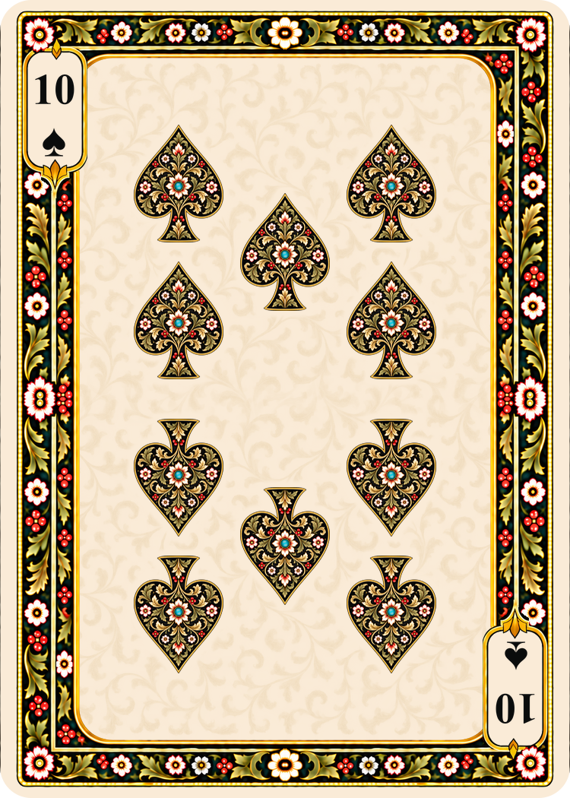
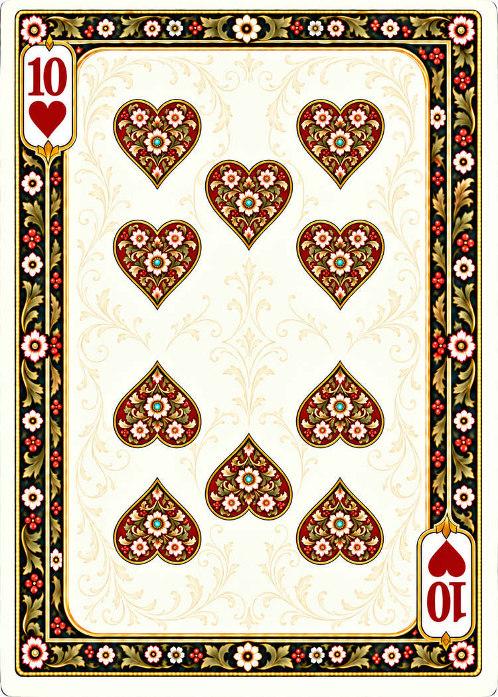
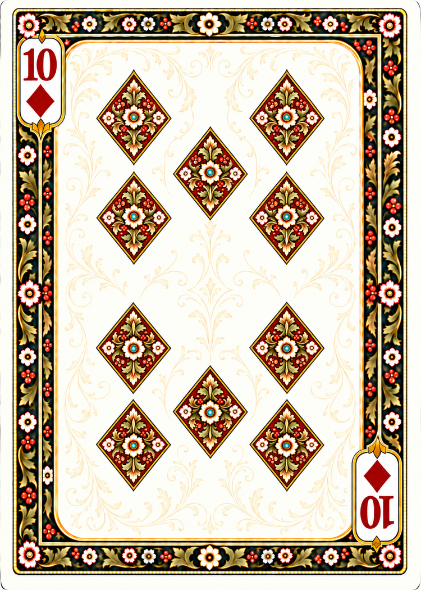

# Wide-panel numeral cards — tens and replacement twos

Built-in image generation, September 16, 2026. The approved [Ten of Spades](poker-ten-spades-prompts.md) defines the broad ivory panel, pale champagne-gold filigree, narrow botanical frame and miniature ace-style pips.

The three additional tens are saved at `cards/faces/french-suited/poker/<suit>/10.png`. Their 1060 × 1484 generated masters are retained locally at `work/numerals/<suit>-10-filigree-master.png`. The established export helper produces 750 × 1050, nominal 300 DPI, with no cropping or stretching. Work files are Git-ignored.

All ten center pips and both corner indices were visually checked. The initial Diamonds render incorrectly retained flared spade stems on three lower pips; a corrective generation replaced those with true four-point diamonds. Exact internal ornament repetition, orientation and half-turn symmetry are not guaranteed by the generative process.

## Tens gallery

| Spades | Hearts | Diamonds | Clubs |
| --- | --- | --- | --- |
|  |  |  |  |


## Replacement twos — pending usage reset

The user authorized replacement of all four twos with the approved wide-panel design if usage remained. After completing the tens, the usage-status tool still reported ordinary usage allowed, with 6% of the five-hour window and 5% of the weekly window remaining. All four image-generation requests nevertheless returned HTTP 429 `usage_limit_reached`. No replacement image was produced and no existing two was modified. These prompts are retained for the next attempt. Original twos are also backed up locally under `work/numerals/previous-twos/`.

### Pending Two of spades

```text
Use case: precise-object-edit. Convert this approved TEN OF SPADES into the matching TWO OF SPADES.
Keep the exact wide rounded rectangular ivory panel, PALE champagne-gold acanthus filigree, narrow dark botanical perimeter, floral palette, gold lines and beads, corner cartouche positions, rounded ivory outer edge and 5:7 canvas. This is the new number-card frame; never restore a lobed or scalloped central panel.
Replace the ten center emblems with EXACTLY TWO matching ornate miniature ace-style pips, on the vertical centerline x=50%, at y=33% and y=67%. Each pip is the SAME SIZE and same intricate botanical design as a SINGLE pip in this input ten, not enlarged into an ace. Keep gold/olive foliage, ivory/red blossoms, berries, turquoise jewel in ivory rosette, gold outline and visible suit-colored ground. No additional suit emblems anywhere in the ivory panel. Fill vacated positions cleanly with the matching ivory and faint filigree, no ghosts.
SUIT: black spades; upper tip up/stem down, lower stem up/tip down. Upper pip upright, lower whole emblem and its ornament rotated 180 degrees. Two clear separated pips, ample open ivory between them.
Change each serif corner '10' to a single serif '2', same ink color and cap height, centered gracefully inside its existing ivory cartouche. Keep the small solid corner suit marks unchanged, with the bottom-right complete 2/suit index pair inverted. Corner pips stay solid; central pips stay richly botanical.
Exactly TWO center ornate pips plus TWO small solid corner marks, and exactly TWO number 2 labels. No 10 or A remaining. Preserve all border and background style. One full flat card, 1060x1484 pixels, exact 5:7 portrait proportions matching the input.
```

### Pending Two of hearts

```text
Use case: precise-object-edit. Convert this approved TEN OF HEARTS into the matching TWO OF HEARTS.
Keep the exact wide rounded rectangular ivory panel, PALE champagne-gold acanthus filigree, narrow dark botanical perimeter, floral palette, gold lines and beads, corner cartouche positions, rounded ivory outer edge and 5:7 canvas. This is the new number-card frame; never restore a lobed or scalloped central panel.
Replace the ten center emblems with EXACTLY TWO matching ornate miniature ace-style pips, on the vertical centerline x=50%, at y=33% and y=67%. Each pip is the SAME SIZE and same intricate botanical design as a SINGLE pip in this input ten, not enlarged into an ace. Keep gold/olive foliage, ivory/red blossoms, berries, turquoise jewel in ivory rosette, gold outline and visible suit-colored ground. No additional suit emblems anywhere in the ivory panel. Fill vacated positions cleanly with the matching ivory and faint filigree, no ghosts.
SUIT: madder-red hearts without stems; upper notch up/point down, lower point up/notch down. Upper pip upright, lower whole emblem and its ornament rotated 180 degrees. Two clear separated pips, ample open ivory between them.
Change each serif corner '10' to a single serif '2', same ink color and cap height, centered gracefully inside its existing ivory cartouche. Keep the small solid corner suit marks unchanged, with the bottom-right complete 2/suit index pair inverted. Corner pips stay solid; central pips stay richly botanical.
Exactly TWO center ornate pips plus TWO small solid corner marks, and exactly TWO number 2 labels. No 10 or A remaining. Preserve all border and background style. One full flat card, 1060x1484 pixels, exact 5:7 portrait proportions matching the input.
```

### Pending Two of diamonds

```text
Use case: precise-object-edit. Convert this approved TEN OF DIAMONDS into the matching TWO OF DIAMONDS.
Keep the exact wide rounded rectangular ivory panel, PALE champagne-gold acanthus filigree, narrow dark botanical perimeter, floral palette, gold lines and beads, corner cartouche positions, rounded ivory outer edge and 5:7 canvas. This is the new number-card frame; never restore a lobed or scalloped central panel.
Replace the ten center emblems with EXACTLY TWO matching ornate miniature ace-style pips, on the vertical centerline x=50%, at y=33% and y=67%. Each pip is the SAME SIZE and same intricate botanical design as a SINGLE pip in this input ten, not enlarged into an ace. Keep gold/olive foliage, ivory/red blossoms, berries, turquoise jewel in ivory rosette, gold outline and visible suit-colored ground. No additional suit emblems anywhere in the ivory panel. Fill vacated positions cleanly with the matching ivory and faint filigree, no ghosts.
SUIT: madder-red four-point diamond rhombi with four straight sides, sharp apexes and NO stems, necks, flat-topped caps or lobes; lower botanical artwork rotated 180 degrees. Upper pip upright, lower whole emblem and its ornament rotated 180 degrees. Two clear separated pips, ample open ivory between them.
Change each serif corner '10' to a single serif '2', same ink color and cap height, centered gracefully inside its existing ivory cartouche. Keep the small solid corner suit marks unchanged, with the bottom-right complete 2/suit index pair inverted. Corner pips stay solid; central pips stay richly botanical.
Exactly TWO center ornate pips plus TWO small solid corner marks, and exactly TWO number 2 labels. No 10 or A remaining. Preserve all border and background style. One full flat card, 1060x1484 pixels, exact 5:7 portrait proportions matching the input.
```

### Pending Two of clubs

```text
Use case: precise-object-edit. Convert this approved TEN OF CLUBS into the matching TWO OF CLUBS.
Keep the exact wide rounded rectangular ivory panel, PALE champagne-gold acanthus filigree, narrow dark botanical perimeter, floral palette, gold lines and beads, corner cartouche positions, rounded ivory outer edge and 5:7 canvas. This is the new number-card frame; never restore a lobed or scalloped central panel.
Replace the ten center emblems with EXACTLY TWO matching ornate miniature ace-style pips, on the vertical centerline x=50%, at y=33% and y=67%. Each pip is the SAME SIZE and same intricate botanical design as a SINGLE pip in this input ten, not enlarged into an ace. Keep gold/olive foliage, ivory/red blossoms, berries, turquoise jewel in ivory rosette, gold outline and visible suit-colored ground. No additional suit emblems anywhere in the ivory panel. Fill vacated positions cleanly with the matching ivory and faint filigree, no ghosts.
SUIT: black clubs with three round lobes and flared stem; upper round lobe up/stem down, lower stem up/round lobe down. Upper pip upright, lower whole emblem and its ornament rotated 180 degrees. Two clear separated pips, ample open ivory between them.
Change each serif corner '10' to a single serif '2', same ink color and cap height, centered gracefully inside its existing ivory cartouche. Keep the small solid corner suit marks unchanged, with the bottom-right complete 2/suit index pair inverted. Corner pips stay solid; central pips stay richly botanical.
Exactly TWO center ornate pips plus TWO small solid corner marks, and exactly TWO number 2 labels. No 10 or A remaining. Preserve all border and background style. One full flat card, 1060x1484 pixels, exact 5:7 portrait proportions matching the input.
```

## Generation prompts

### Ten of hearts

```text
Use case: precise-object-edit. Create the TEN OF HEARTS in the approved Design 1 numeral-card design.
IMAGE 1 is the approved Ten of Spades: EDIT TARGET, exact layout, canvas, frame, pale filigree and miniature-pip-scale reference.
IMAGE 2 is the Ace of hearts: supporting reference ONLY for the suit emblem to miniaturize. Do not copy its large emblem or lobed frame.
Change ONLY the suit of all TEN central pips and the two corner suit marks; recolor both number indices for a red suit. Keep every central pip at exactly its existing position and approximately its existing size. Preserve the same ten layout: four in the left column, four in the right column, two in the center column. Upper center pip is between first and second side rows; lower center pip between third and fourth. Exactly TEN central pips, never nine, eleven or twelve.
SUIT: Deep MADDER-RED HEARTS: two broad rounded lobes, deep top notch and sharp bottom point, no stem. Upper five upright hearts point DOWN; lower five inverted hearts point UP. Miniaturize the actual heart emblem in Image 2. Both '10' indices and both solid small corner hearts are madder red.
Every central pip is an ornate miniature of this suit's ace: visible suit-colored ground, fine gold double contour, golden and olive acanthus, ivory flowers tipped red, berries, central ivory rosette with a turquoise jewel. Retain the richness and delicacy of the approved Spades pip art. All ten pips have identical size. Top five upright, bottom five fully rotated counterparts, including internal ornament. Clear ivory breathing space around each pip.
Preserve Image 1's NEW BROAD ROUNDED-RECTANGULAR IVORY FIELD, extremely pale champagne-gold acanthus filigree across its background, thin gold inner boundary, NARROW NEAR-BLACK BOTANICAL PERIMETER, all floral motifs and palette, beaded outer gold rectangle, ivory edge, rounded card corners and index cartouches. Do not restore the old narrow lobed ace field. Keep the filigree faint and subordinate.
Corner indices: serif "10" on one line over a small SOLID conventional suit mark at top-left, identical entire pair rotated 180 degrees bottom-right. Same font, height and position as Image 1. No A or other text; only the two "10" indices. Corner pips are solid, center pips richly floral.
ONE flat full-card output, 1060x1484 pixels, EXACT 5:7 portrait proportions matching Image 1. No cropping, stretching, new composition, extra marks, mockup or outside background. This is a careful suit substitution within the approved ten-card template.
```

### Ten of diamonds

```text
Use case: precise-object-edit. Create the TEN OF DIAMONDS in the approved Design 1 numeral-card design.
IMAGE 1 is the approved Ten of Spades: EDIT TARGET, exact layout, canvas, frame, pale filigree and miniature-pip-scale reference.
IMAGE 2 is the Ace of diamonds: supporting reference ONLY for the suit emblem to miniaturize. Do not copy its large emblem or lobed frame.
Change ONLY the suit of all TEN central pips and the two corner suit marks; recolor both number indices for a red suit. Keep every central pip at exactly its existing position and approximately its existing size. Preserve the same ten layout: four in the left column, four in the right column, two in the center column. Upper center pip is between first and second side rows; lower center pip between third and fourth. Exactly TEN central pips, never nine, eleven or twelve.
SUIT: Deep MADDER-RED DIAMONDS: elongated conventional rhombi with four straight sides and four sharp points, no lobes or stems. Miniaturize the actual diamond emblem in Image 2. Rotate the lower five diamonds' internal botanical illustrations by 180 degrees relative to the upper five. Both '10' indices and both solid small corner diamonds are madder red.
Every central pip is an ornate miniature of this suit's ace: visible suit-colored ground, fine gold double contour, golden and olive acanthus, ivory flowers tipped red, berries, central ivory rosette with a turquoise jewel. Retain the richness and delicacy of the approved Spades pip art. All ten pips have identical size. Top five upright, bottom five fully rotated counterparts, including internal ornament. Clear ivory breathing space around each pip.
Preserve Image 1's NEW BROAD ROUNDED-RECTANGULAR IVORY FIELD, extremely pale champagne-gold acanthus filigree across its background, thin gold inner boundary, NARROW NEAR-BLACK BOTANICAL PERIMETER, all floral motifs and palette, beaded outer gold rectangle, ivory edge, rounded card corners and index cartouches. Do not restore the old narrow lobed ace field. Keep the filigree faint and subordinate.
Corner indices: serif "10" on one line over a small SOLID conventional suit mark at top-left, identical entire pair rotated 180 degrees bottom-right. Same font, height and position as Image 1. No A or other text; only the two "10" indices. Corner pips are solid, center pips richly floral.
ONE flat full-card output, 1060x1484 pixels, EXACT 5:7 portrait proportions matching Image 1. No cropping, stretching, new composition, extra marks, mockup or outside background. This is a careful suit substitution within the approved ten-card template.
```

### Ten of clubs

```text
Use case: precise-object-edit. Create the TEN OF CLUBS in the approved Design 1 numeral-card design.
IMAGE 1 is the approved Ten of Spades: EDIT TARGET, exact layout, canvas, frame, pale filigree and miniature-pip-scale reference.
IMAGE 2 is the Ace of clubs: supporting reference ONLY for the suit emblem to miniaturize. Do not copy its large emblem or lobed frame.
Change ONLY the suit of all TEN central pips and the two corner suit marks; recolor both number indices for a red suit. Keep every central pip at exactly its existing position and approximately its existing size. Preserve the same ten layout: four in the left column, four in the right column, two in the center column. Upper center pip is between first and second side rows; lower center pip between third and fourth. Exactly TEN central pips, never nine, eleven or twelve.
SUIT: BLACK CLUBS: three round lobes and a short flared stem, no pointed spade tip. Miniaturize the actual club emblem in Image 2. Upper five clubs have round top lobe UP and stem DOWN; lower five are fully inverted with stem UP and round lobe DOWN. Both '10' indices and both solid small corner clubs are black.
Every central pip is an ornate miniature of this suit's ace: visible suit-colored ground, fine gold double contour, golden and olive acanthus, ivory flowers tipped red, berries, central ivory rosette with a turquoise jewel. Retain the richness and delicacy of the approved Spades pip art. All ten pips have identical size. Top five upright, bottom five fully rotated counterparts, including internal ornament. Clear ivory breathing space around each pip.
Preserve Image 1's NEW BROAD ROUNDED-RECTANGULAR IVORY FIELD, extremely pale champagne-gold acanthus filigree across its background, thin gold inner boundary, NARROW NEAR-BLACK BOTANICAL PERIMETER, all floral motifs and palette, beaded outer gold rectangle, ivory edge, rounded card corners and index cartouches. Do not restore the old narrow lobed ace field. Keep the filigree faint and subordinate.
Corner indices: serif "10" on one line over a small SOLID conventional suit mark at top-left, identical entire pair rotated 180 degrees bottom-right. Same font, height and position as Image 1. No A or other text; only the two "10" indices. Corner pips are solid, center pips richly floral.
ONE flat full-card output, 1060x1484 pixels, EXACT 5:7 portrait proportions matching Image 1. No cropping, stretching, new composition, extra marks, mockup or outside background. This is a careful suit substitution within the approved ten-card template.
```

### Diamonds outline correction

```text
Use case: precise-object-edit.
Correct visual glitches in this TEN OF DIAMONDS. Preserve the complete card, dimensions, botanical border, pale filigree, typography, indices, colors, positions and size of all ten pips.
The problem: THREE lower-half diamond pips have erroneous flat-topped flared SPADE STEMS at their upper tips. They resemble little vases instead of diamonds. Also the bottom two pips have their botanical artwork upright when it should be inverted.
FIX ALL FIVE LOWER-HALF CENTRAL DIAMOND PIPS:
Every lower pip must be a TRUE GEOMETRIC DIAMOND RHOMBUS, exactly FOUR STRAIGHT SIDES meeting at exactly FOUR SHARP POINTS. Its upper point must be a SINGLE SHARP APEX, never a flat edge, neck, notch, flared stem, trapezoid or curved shoulder. Its lower point must also be a sharp apex. No stem anywhere on any diamond. Take the correctly drawn TOP-LEFT diamond as the shape and interior artwork master. Each of the FIVE LOWER diamonds should be an identical 180-degree rotated miniature copy of that correct top-left diamond, fitted into its current position and same size. Rotate the flowers and foliage too: upside-down white/gold floral tip at the bottom, inverted ornament. Keep its gold double contour and red ground.
The three malformed pips are: lower-half left near 33%,59%; lower-half right near67%,59%; and lower center near50%,69%. Replace their flat flared tops with actual diamond tips. Also rotate the INTERNAL ornament of the lowest left/right pair to match the lower-half orientation. Keep all five upper-half diamonds as they are.
There must still be TEN central red diamond pips: four in each side column, two interleaved in the center. Five upright decorated diamonds on top; five inverted decorated diamonds below. The outside diamond silhouette is naturally identical when rotated 180 degrees.
Keep both corner suit marks as solid red diamonds, both red serif '10' indices unchanged. Do not add or remove pips, change the layout, resize them, alter the filigree or frame, or add new symbols.
Output ONE complete flat corrected card at 1060x1484 pixels, exact 5:7 portrait matching the input. All TEN large pips MUST have true four-point rhombus outlines with NO stem.
```
