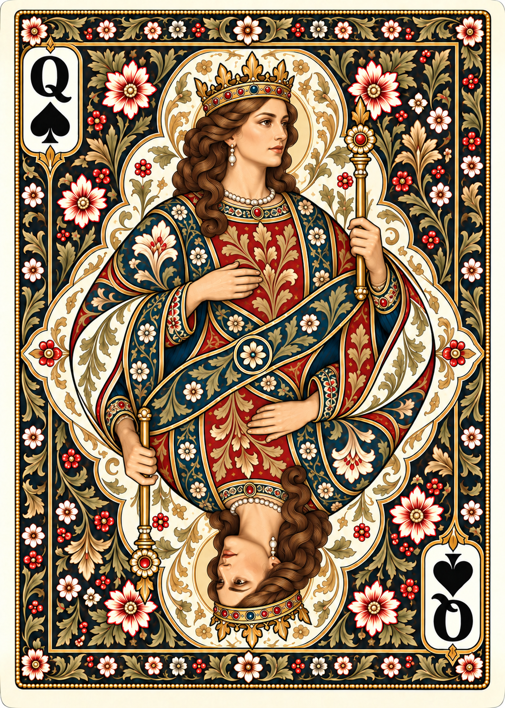
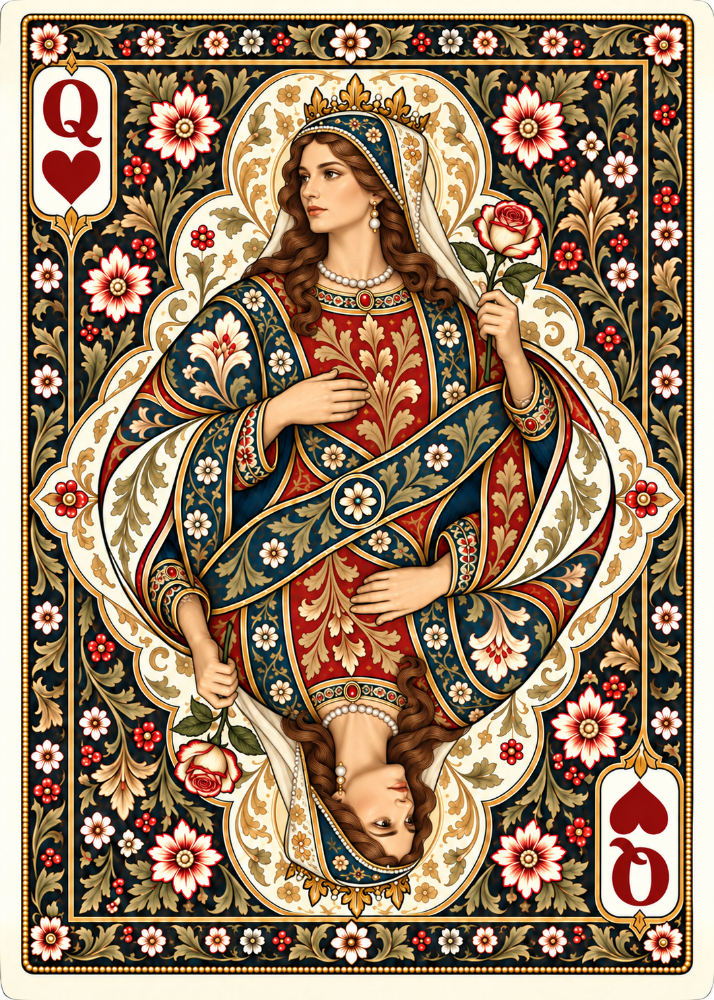
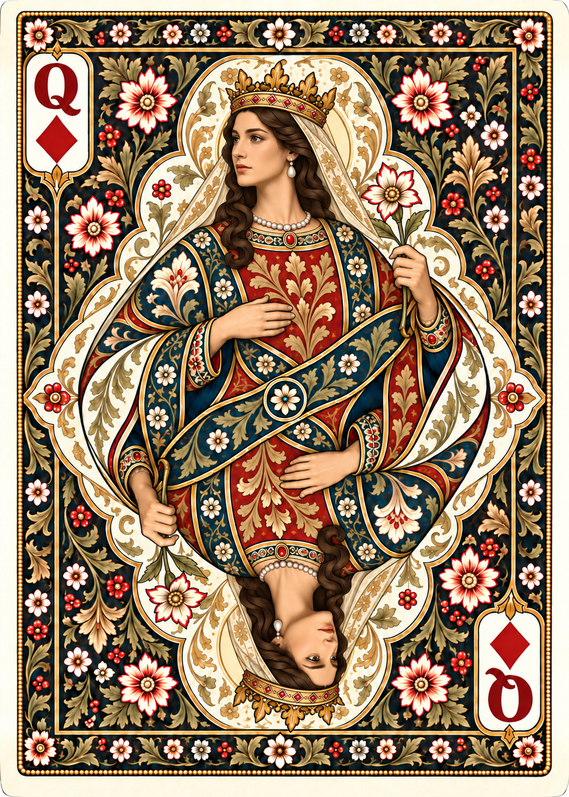
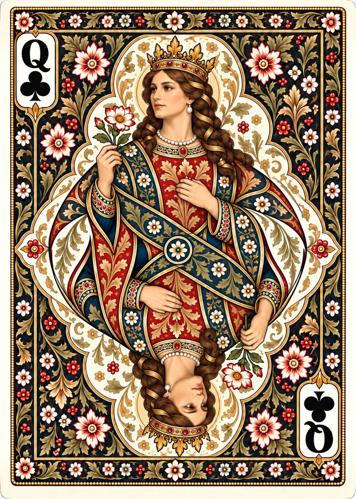

# Poker queens

Four queens generated with the built-in imagegen tool, using the existing Spades king as the initial layout/style reference and the Lamp Black back as the botanical reference. Hearts, Diamonds and Clubs were then developed from the new Spades queen. See the [complete prompts](poker-queens-prompts.md).

## Gallery

| Spades | Hearts | Diamonds | Clubs |
| --- | --- | --- | --- |
|  |  |  |  |

## Shared style

The queens retain the kings' ivory outer edge, rectangular gold-beaded frame, floral border, lobed ivory/gold medallion, flowing patterned garments and central rosette. All four use navy, madder red, warm ivory, antique gold and olive foliage, with a dark floral field. These faces pair with all five poker-back colors.

The portraits use softly modeled naturalistic Art Nouveau faces and hands. Figure scale and head clearance follow the reduced kings. Each card is double-ended, with Q/suit indices in opposing ivory cartouches. Spades and Clubs indices are black; Hearts and Diamonds are red.

## Individual attributes

| Suit | Direction of upright portrait | Attributes |
| --- | --- | --- |
| Spades | Slightly right, both eyes visible | Gold scepter with floral finial; waved chestnut hair and pearl jewelry |
| Hearts | Slightly left, both eyes visible | Cream/red rose; crowned embroidered hood and ivory veil |
| Diamonds | Slightly left, both eyes visible | Pointed-petal ivory/red flower; diamond crown settings and ivory veil |
| Clubs | Slightly left, both eyes visible | Flower sprig with unopened bud; ribbon-woven braids; gathered mantle |

Diamonds received a separate correction because its first rendering kept the source queen's rightward gaze. The Clubs rendering varied the gesture and diagonal sash direction while retaining the shared frame and palette; its flower is held on the viewer's left.

## Historical references

These are new illustrations following the deck's established design, not reconstructions of one historical pattern. The user's Gemini material supplies associations and visual suggestions. Named Paris courts and anonymous Anglo-American courts belong to distinct traditions; we did not print historical names. [IPCS: court figures](https://i-p-c-s.org/faq/history_12.php)

The scepter distinguishes the Queen of Spades in the English pattern. [IPCS: court design](https://i-p-c-s.org/faq/tmfaq2.php)

Hearts' headdress is a stylistic interpretation of the requested Tudor reference, not a claim to reproduce a documented Elizabeth of York likeness. Diamonds holds its flower naturally by the stem. Clubs' portrait makes no claim to identify Argine with a particular historical woman.

## Validation and status

All four PNGs are 1060 × 1484 pixels, exactly 5:7, and provide 424 PPI when placed at the intended 2.5 × 3.5-inch poker trim. The 96-DPI file metadata remains unchanged; the catalog records explicit physical sizes.

The saved PNGs are byte-for-byte copies of the selected imagegen outputs. All 34 previously cataloged images were checked against their recorded hashes and remain unchanged. No raster post-processing, resampling or modifications to the kings/backs were performed.

Visual review checked Q indices and suit colors, visible eyes, held objects, crown clearance, framing, figure scale and palette. These remain review masters: painted flower details and the two portrait halves are not pixel-exact repetitions. No new claim of exact symmetry, shared pixel plates, bleed or imposed print sheets is made.

The repository now contains eight of the 52 standard French-suited poker fronts. The other 44 fronts remain to be generated; optional jokers would be additional cards.
